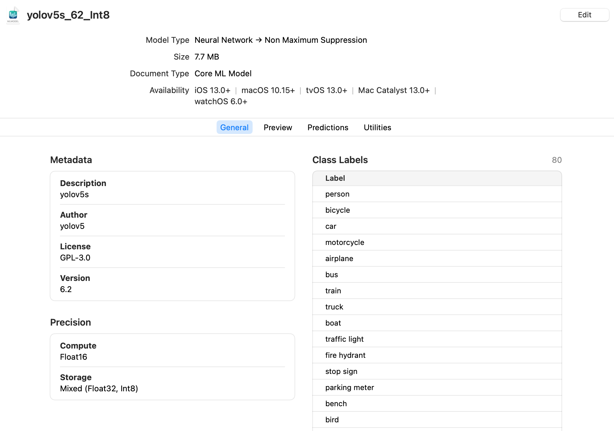
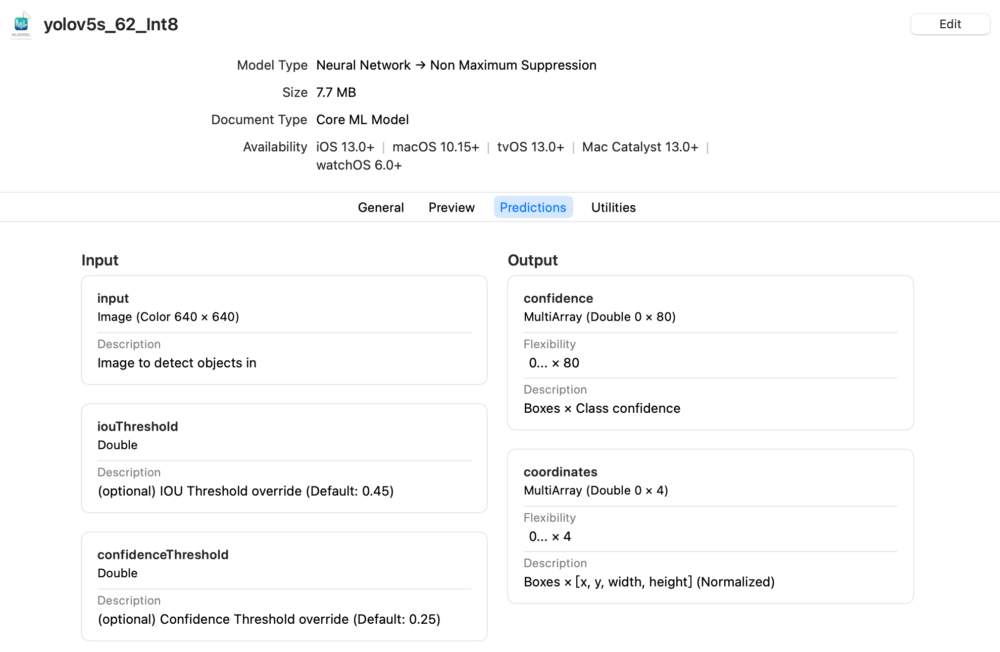

<div align=center>
English | <a href=https://blog.csdn.net/qq_42485643/article/details/127495536>简体中文</a>
</div>

## Introduction

This repo provides a Weight Conversion Tool which can be used to export a Yolov5 model (e.g., yolov5s.pt) to a CoreML model (e.g., yolov5s.mlmodel) with a decoding layer and an non maximum suppression layer (NMS).


## Advantages

Compared to other tools, it:

- **Can be used simply and quickly**

  After setting up the environment, you just need to input a Yolov5 model with its parameters in [convert.py](convert.py)  to get the CoreML model.

- **Support quantization**

  In addition to the default obtained Fp32 model, Fp16 and Int8 quantization is also supported in our tool. 
  ***Note:*** *Quantization is supported on both MacOS and Linux while we haven't tested it on windows yet.*
  
- **Can be previewed on Xcode without coding**

  We added a decoding layer and an NMS layer in comparison to the [official weight conversion tools](https://github.com/ultralytics/yolov5/issues/251) so that the exported model works nice with Apple version framework and can be previewed on Xcode without any coding.

  

## Before You Start

Yolov5 is required for this tool, so clone [Yolov5 repo](https://github.com/ultralytics/yolov5) first and install [requirements.txt](https://github.com/ultralytics/yolov5/blob/master/requirements.txt) in a Python >= 3.8.0 environment. 

```shell
git clone https://github.com/ultralytics/yolov5 # clone
cd yolov5
git checkout v6.2                    # (recommend)switch to v6.2 tag
pip install -r requirements.txt      # install environment
```

Then, clone this repo and install `coremltools == 6.0` .

```shell
git clone https://github.com/ClintRen/ yolov5_convert_weight_to_coreml.git  # clone
cd yolov5_convert_weight_to_coreml
pip install coremltools==6.0         # install
pip install numpy==1.23.1            # **IMPORTANT** New version of numpy may cause a attribute error
```

***Note:*** *We recommend using `yolov5 == 6.2.0` and `coremltools == 6.0` as we tested.* 

## Usage

Some of the parameters should be changed in [convert.py](convert.py) to meet you needs:

| Parameters      | Explanations                          |
| --------------- | ------------------------------------- |
| `--yolov5-repo` | path to your yolov5 repo              |
| `--weight`      | yolov5 weights path                   |
| `--img-size`    | image imput size (pixels)             |
| `--conf-thres`  | confidence threshold                  |
| `--iou-thres`   | NMS IoU threshold                     |
| `--device`      | cuda device, i.e. 0 or 0,1,2,3 or cpu |
| `--quantize`    | quantize model to FP16 and Int8       |
| `--description` | model description                     |
| `--author`      | model author                          |
| `--version`     | model version                         |
| `--license`     | model license                         |

## Example
This command exports a pretrained Yolov5s model to a CoreML model.  The CoreML models (yolov5s.mlmodel, yolov5s_FP16.mlmodel and yolov5s_Int8.mlmodel) will be generated in the weight directory.

```shell
python convert.py --yolov5-repo /path/to/yolov5 --weight yolov5s.pt --img-size 640 --quantize
```

***Tip :** add `--quantize` to export models at Fp16 and Int8 precision for smaller file sizes.*


## Preview on Xcode

After exporting the CoreML models, you can preview them on Xcode without coding. 

The details and preview examples are shown below, please give a star if it helps you, thanks. 






